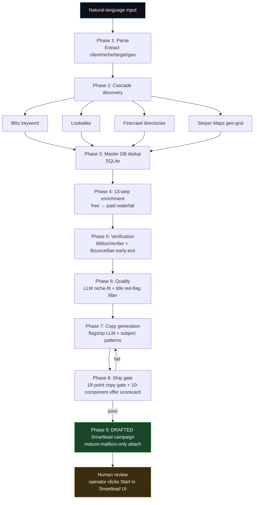
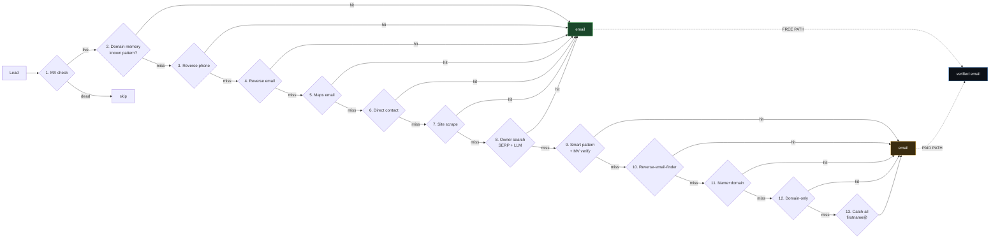
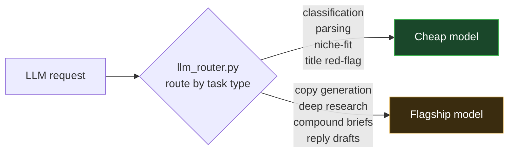
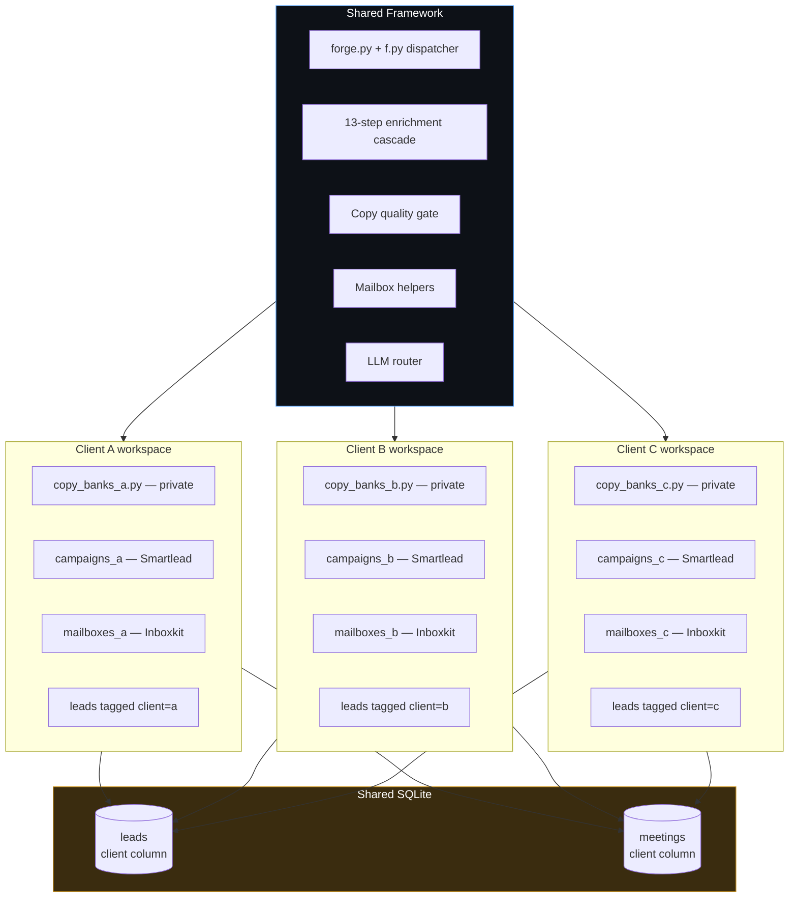
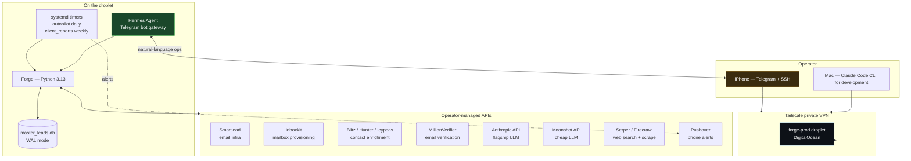

# Agency OS — Production B2B Outbound Infrastructure Framework

Open-source framework for production-grade B2B outbound operations. Built and operated end-to-end on Python 3.13 + Claude Code skills.

> **Status:** runs in production. Public version is sanitized of client data, copy banks, and proprietary patterns. The framework + architecture are open-sourced as a portfolio artifact.

## What this is

A complete operational stack for B2B outbound — discovery → enrichment → verification → copy generation → DRAFTED Smartlead campaign — with multi-tenant data isolation, safety rules codified in code, and an LLM cost router.

## Notable components

### 1. LLM cost router (`llm_router.py`)
Routes light tasks (classification, parsing) to a cheap model and heavy tasks (copy generation, deep research) to a flagship model.

### 2. 18-point copy quality gate (`tools/copy_quality_gate.py`)
Programmatic rubric every cold email passes before ship:
- Em-dash detection
- Anti-pattern matching ("we help", "I hope this finds you well")
- Spintax structure validation
- Subject-pattern format detection (colleague_internal, vendor_scheduling, customer_inquiry)
- Single-CTA enforcement
- Minimum score required to ship

### 3. 13-step enrichment cascade (`tools/forge_enrich.py`)
Free paths first, paid paths only when free fails:

```
FREE (steps 1-8):
  1. MX pre-check               (skip dead domains)
  2. Domain memory               (known patterns cached)
  3. Reverse phone lookup        (phone → owner → email)
  4. Reverse email lookup        (info@ → who manages it → personal email)
  5. Google Maps email
  6. Direct contact API
  7. Website scraping
  8. Owner search via SERP + LLM

PAID (steps 9-13, only if free fails):
  9. Smart-pattern guess + verify
  10. Reverse-email-finder
  11. Name + domain finder
  12. Domain-only finder
  13. Catch-all acceptance
```

### 4. Code-enforced safety rules (`mailbox_helpers.py`)
The 14-day mailbox maturity rule lives at the code layer, not in docs:

```python
def is_mature(acct: dict, min_age_days: int = 14, min_warmup_pct: int = 100):
    """Hard rule: mailbox must be at least N days old AND at min reputation."""
    return _age_days(acct) >= min_age_days and _warmup_pct(acct) >= min_warmup_pct
```

Wrappers around `Smartlead.attach_email_account()` route through this so no campaign can attach an unmature mailbox in production.

### 5. Compounding-data feedback loop (`tools/forge_compound.py`)
After every campaign cycle, joins the leads + meetings tables, identifies which industries, titles, and geos converted, and writes a markdown brief that feeds the next campaign's prompt as context.

### 6. Subagent dispatch for parallel research
The `/lookalike-research` slash command dispatches N parallel Claude Code subagents — each independently researches lookalike companies matching a signal profile, then results are aggregated, deduplicated, and ingested. See `tools/forge_lookalike_research.py` + `.claude/commands/lookalike-research.md`.

### 7. Operational rhythm codified as a slash command
The `/weekly-rhythm` skill is a pure operational playbook (Mon/Wed/Fri/biweekly/monthly/quarterly cadences) with no scripts.

### 8. 4-point campaign diagnostic (`/diagnose-campaign`)
Top-down: deliverability → targeting → copy/offer → speed-to-lead. Stops at the first failed layer because layers below a failure are noise.

## Architecture — pipeline overview



## 13-step enrichment cascade

Free paths exhaust before any paid call fires.



## LLM cost router

Heavy work routes to flagship only when the cost premium is justified by output quality.



## Multi-tenant data isolation

Multiple clients share infrastructure but never share leads, mailboxes, copy banks, or DBs.



## Deployment architecture



## Stack

- **Language:** Python 3.13
- **Database:** SQLite (WAL mode)
- **LLMs:** Anthropic Claude (heavy) + Moonshot Kimi (light)
- **Email infra:** Smartlead, Inboxkit, MillionVerifier
- **Discovery:** Blitz, AI Ark, Firecrawl, Serper Maps
- **Enrichment:** Hunter, Icypeas, MillionVerifier
- **Subagents:** Claude Code Task tool
- **Deploy:** DigitalOcean droplet + systemd timers + Tailscale
- **Conversational layer:** Hermes Agent for Telegram-bot ops

## See it in action

Concrete walkthroughs of the framework's key mechanisms (synthetic data, real architecture):

- [Sample lead through the 13-step cascade](examples/sample_lead_walkthrough.md) — fictional lead routed through every step, showing what each one tries and how the cascade short-circuits on hit
- [Copy quality gate worked examples](examples/copy_quality_gate_examples.md) — 3 fictional emails through the 18-point gate (PASS / FAIL / borderline), with full score breakdowns
- [Architecture decisions](docs/architecture_decisions.md) — the WHY behind 5 key design choices, with the failure modes each one prevents

## Repository structure

```
agency-os/
├── README.md                            (this file)
├── CLAUDE.md                            operating doctrine
├── HERMES.md                            Hermes Agent integration bridge
├── COOKBOOK.md                          goal-oriented "I want to ___, run this"
├── SOP.md                               operational policies
├── WORKFLOW.md                          end-to-end campaign workflow
├── forge.py                             top-level orchestrator
├── f.py                                 unified CLI dispatcher (50+ subcommands)
├── doctor.py                            7-category health check
├── llm_router.py                        cost-aware LLM routing
├── mailbox_helpers.py                   14-day maturity rule (code-enforced)
├── master_db.py                         SQLite master leads + meetings
├── enrichment.py                        email enrichment waterfall
├── verification.py                      MV + BB verification
├── tools/
│   ├── forge_compound.py                winning-angles miner from past meetings
│   ├── forge_lookalike_research.py     subagent-dispatch lookalike (3-stage)
│   ├── forge_auto_research.py          autonomous loop
│   ├── competitor_engagers.py           LinkedIn engager harvest from competitors
│   ├── list_quality_scorecard.py        8-dim list grading (A-F before send)
│   ├── copy_quality_gate.py             18-point ship gate
│   ├── score_offer.py                   10-component offer scorecard
│   ├── mailbox_autopilot.py             daily mailbox health watchdog
│   ├── data_quality_check.py            pre-send audit (vertical-aware thresholds)
│   ├── forge_enrich.py                  unified 13-step cascade
│   └── ...                              25+ more showcase tools
└── .claude/commands/
    ├── diagnose-campaign.md             4-point diagnostic
    ├── lookalike-research.md            stage-2 subagent dispatcher
    └── weekly-rhythm.md                 Mon/Wed/Fri operational cadence
```

## What's NOT in this public repo

- Production copy banks (proprietary, agency-tuned per client)
- Real lead databases or CSVs
- Real client identifiers, sender personas, or meeting/conversion data
- API keys (gitignored)
- Winning-angles briefs (these are client deliverables)

## License

MIT — use it, fork it, adapt it.

The framework is open-source. Specific operator implementations (copy banks, client data, trained patterns) are proprietary to their owners.
